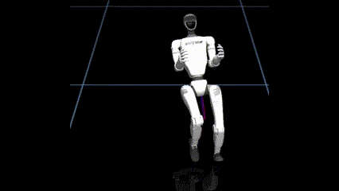
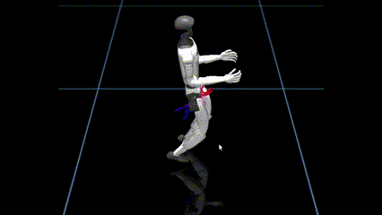

# mppi-cpp

A single-file minimal C++ implementation of MPPI with MuJoCo. Serve as a simple testbed for MPPI's performance with CPU for sampling. 

🚧 **Work in Progress** 🚧

| G1 Control 1 | G1 Control 2 |
| :----------: | :-----------: |
|  |  |

## Build

Ubuntu: 

```sh
sudo apt-get update && sudo apt-get install cmake libgl1-mesa-dev libxinerama-dev libxcursor-dev libxrandr-dev libxi-dev ninja-build clang-12

mkdir build
cd build

cmake .. -DCMAKE_BUILD_TYPE:STRING=Release -G Ninja -DCMAKE_C_COMPILER:STRING=clang-12 -DCMAKE_CXX_COMPILER:STRING=clang++-12

cmake --build . --config=Release
```

## Run

```sh
# run with 16 step prediction horizon, 24 particles per sample and 6 repeats
./bin/mppi "../assets/g1_8dof_mjx_sphere_position.xml" 16 24 6
```

## References

- [Mujoco](https://github.com/google-deepmind/mujoco)
- [RS.cpp](https://github.com/thowell/rs.cpp)